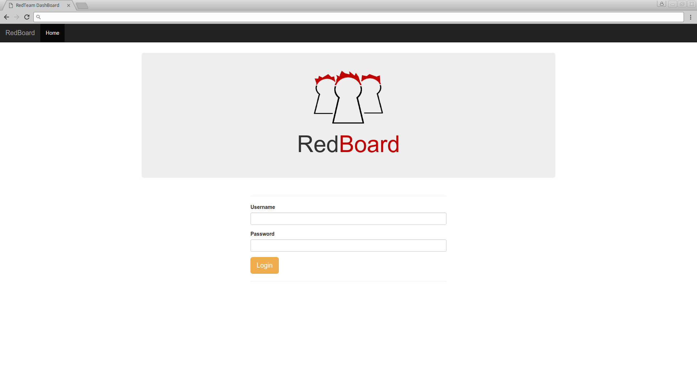
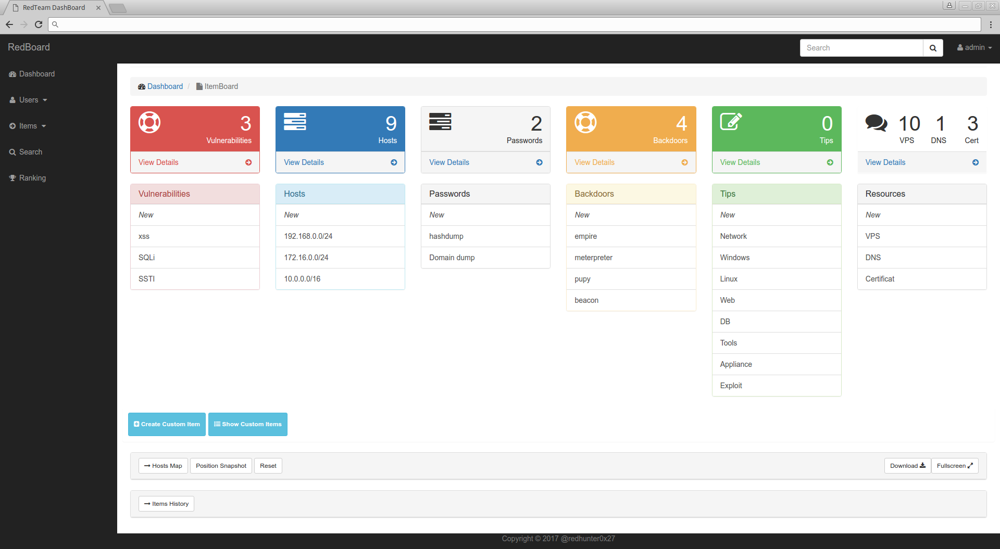
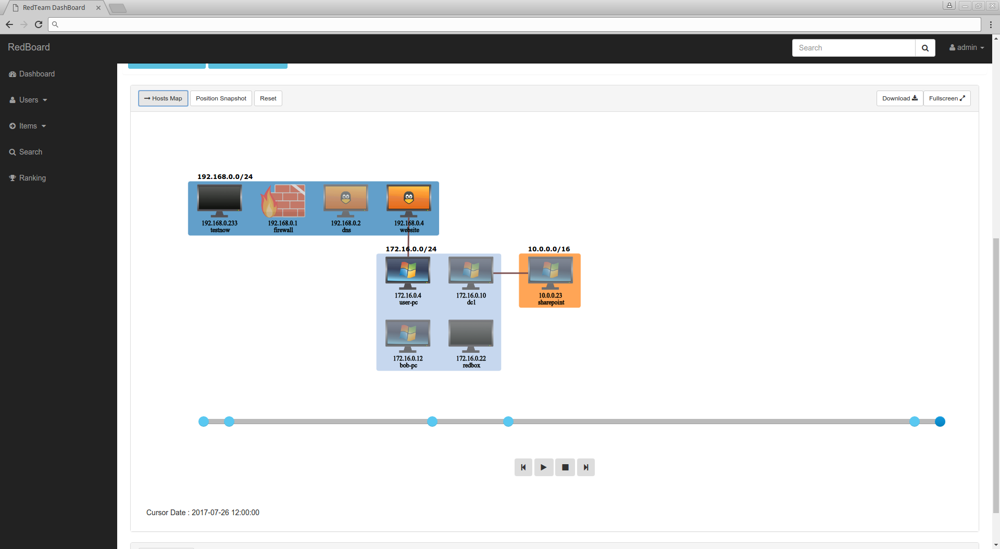
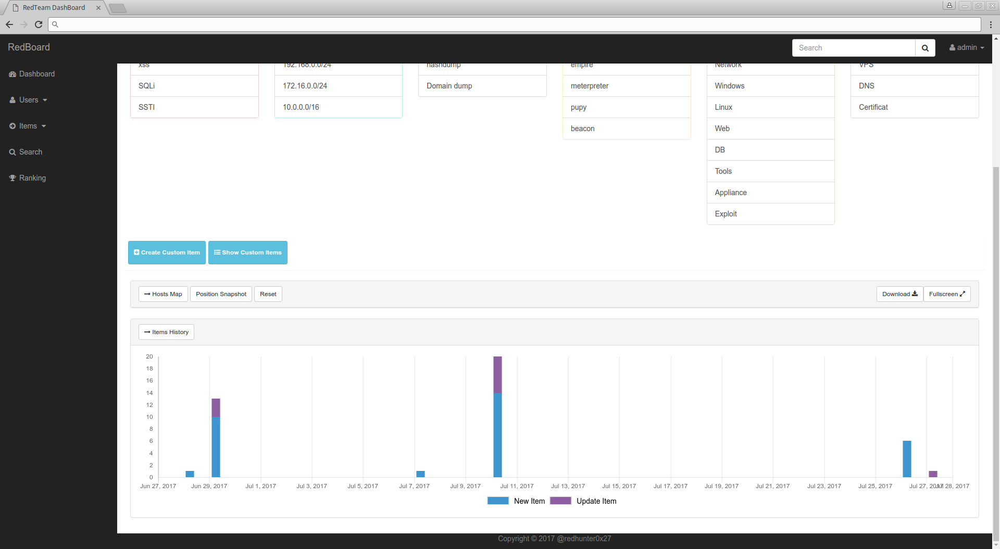
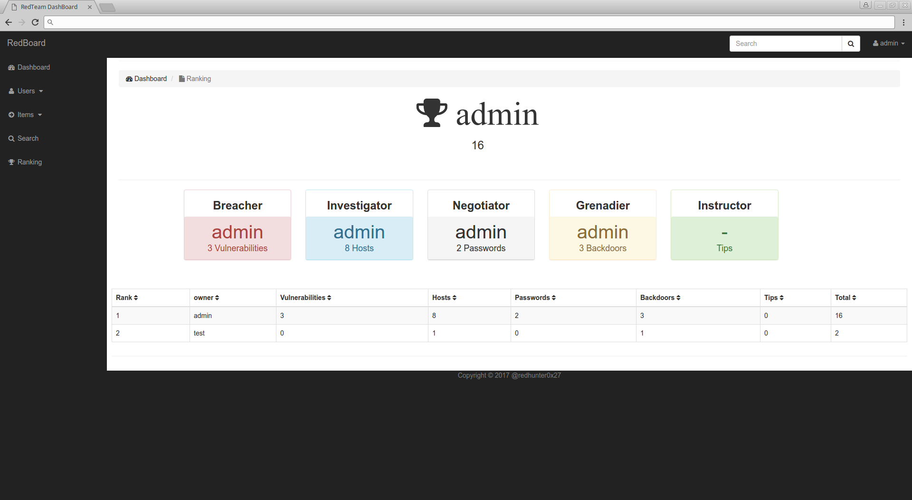

<b> RedBoard</b>

## Introduction

RedBoard is a collaborative web dashboard for RedTeam pentesters.

While conducting a pentest, you're inclined to create a lot of text files in random directories on your laptop. 
RedBoard is a collaborative suite to store, organize and share all sort of data within your team.

#### Features 
	
* store your pentest data and sort it by category 
* keep track of your actions with the items history chart
* create a network map
* animated map with slider bar
* network map have display mode
* create multi-user
* have a full text search engine
* have a ranking system

This tool is developed in nodeJS and use Mongo as a database backend.

## Installation

Install nodeJS and mongodb (ubuntu based):

	sudo apt install mongodb-clients nodejs-legacy npm

You must have mongo >= 3.0 for the search engine to work. 
You can manually install it by using this good link : 

	https://docs.mongodb.com/manual/tutorial/install-mongodb-on-ubuntu/
	
npm dependencies:

	npm install
	
Start RedBoard using

	npm start
	
To create first admin account 

	mongo
	
	use redboard

	db.users.insert({"local" : { "password" : "$2a$08$3LhTS4rfimX47BG4ghEZ1u3jEUG1/QEqdHzUacTXkdpstn1lWEOCG", "username" : "admin", "isAdmin" : true}}) 
	
This command create admin account with login : admin and password : redboard (in bcrypt).

## Configuration

#### Certificate

You can generate your self signed ssl certificate with this command. Put this three files into ssl directory.

	openssl genrsa 1024 > file.pem
	
	openssl req -new -key file.pem -out csr.pem
	
	openssl x509 -req -days 900 -in csr.pem -signkey file.pem -out file.crt

#### Server	

You can change default server port and listen ip by editing 'server.js' (on top file)

	var portSSL	= 8443;	
	var host    = "127.0.0.1";

#### Database

You can change database config by editing 'config/database.js'

## Usage

RedBoard works with "items". Items can be created, edited or deleted. Each item has it category and subcategory.

Current categories are : Vulnerabilities, Hosts, Passwords, Backdoors, Tips and Resources.

Some subcategories are already set in Tips (Network, Windows, Linux, Web, DB, Tools, Appliance, Exploit, Other) and Resources (VPS, Certificate, DNS) categories.

You can create new subcategories by clicking on "New" in categorie. This will add a shortcut to the new subcategory in the dashboard to facilitate the future addition of items in this subcategory.

### Users

Create new user in menu Users -> Create New

Add name, password, admin flag or not.
With admin flag, user can manage users.

You can delete user in menu Users -> Show All

Only users with admin rights can show and use this menu.

### Items

#### Show 

You can show item content by clicking on "View Details" button in dashboard on category.

Then click "edit" on item.

You can show all items (not filter by categories) with menu Items -> Show All.

And sort them by subcategories.

#### Add

You can add item by clicking on shortcut subcategory name under category.

#####  Vulnerabilities category

You can add Vulnerabilities with description and attach files.
You can also attach it to host or other items.

##### Hosts category

In Host category you can set the "Draw" parameter to add it to the network map. 

If the "Owned" parameter is set, the current item will be displayed without gray on the map.

Operating system can be choose to host this will change host icon on map.

Different hosts may be graphically linked together on the map by adding an "Attach Item".

Finally, all hosts within the same subcategory are drawed in the same network.

##### Passwords category

You can add passwords list or dump and attach files.
You can also attach it to host or other items.

##### Backdoors category

In this category you can create item backdoor and attach backdoors to host.
If you attach backdoor to an host, on draw map a white strip on right top of this host is add.

##### Tips category

In this category you can note tips or tricks find during your audit and attach it to an other item or not.

##### Resources category

In this category you can add all the resources you will need during your audit. (VPN servers, DNS records, SSL certificates ...).

##### Custom category

If you do not find the category adapted to your data you can create custom category by clicking on "Create Custom Item".
You will not be able to see it on the dashboard but you can access it by clicking on "Show Custom Items".
 
### Hosts map

Hosts on map could be double click to be edited.

If a backdoor is attached to a host when you double click on host you go to edit backdoor item.

Network map can be exported as a png file by clicking on "Download" button.

Default positions on the map are automatically calculated by Readboard. Hosts positions might be changed by using a drag and drop and then 
saved into the database using the "Position snapshot" button.
Default positions could be restored by using the "Reset" button.

A full screen mode can be used to facilitate your presentation by cliking on "Fullscreen" button on right top.

The slide bar can be used to see the state of the network scheme at a selected date.
Ticks on the slide bar represent the days when there was activity (when items are create or update groups by days).
You can also use media button to animate the map.

### Items History chart

With this chart, you can inspect created or edited items over the days.
You may also display items filtered by date by clicking on link on the chart. 

### Search

To search globaly use search form on right top of web page.

To add filter to your search use menu search.

You can filter by items categories or files.

### Ranking

This menu is only there for the games.
You can see the Hunter who created the most item.
And a ranking by subcategories.

## Other

#### Backup - Restore
Projects might be backuped using the following command: 

	mongodump --db redboard

If you want to restore your mongodb projects, you shall use this command:

	mongorestore --db redboard dump/redboard

#### Offline use

You can use RedBoard offline. Run 

	npm install

command online. 
This command create "node_modules" folder in your redboard directory with all RedBoard dependency.

Then you can copy all Redboard directory with this folder and use it offline (without repeating this step of the installation).

## License

RedBoard Community is released under the AGPL 3.0 license.

## Release Notes

v1.0 - 2017-07-06 
